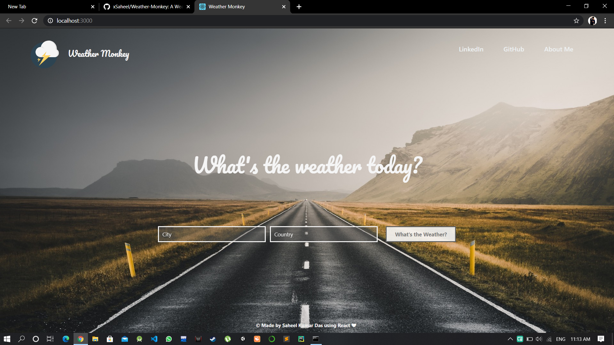
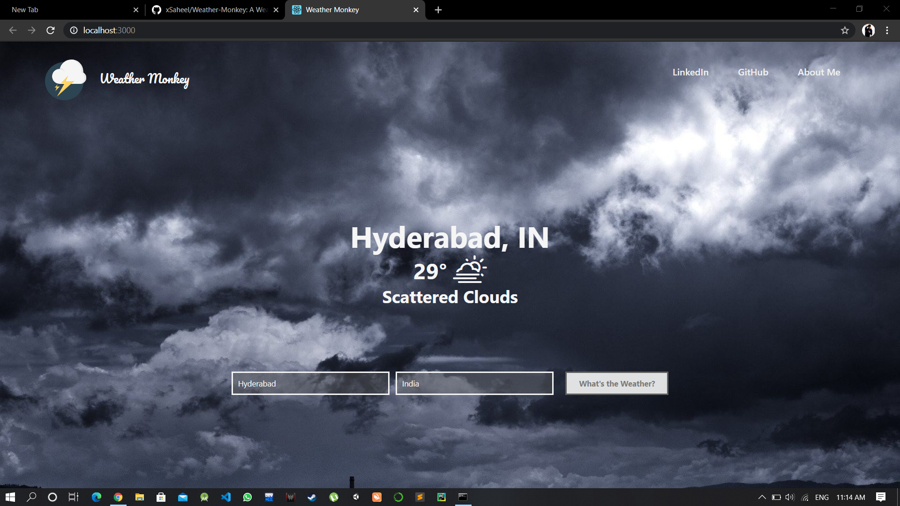
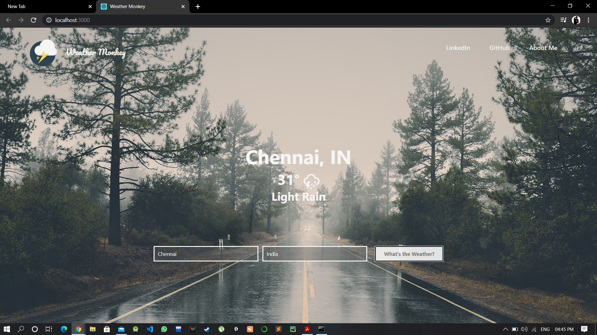

A Weather App made using ReactJS and OpenWeatherAPI.
The App uses Fetch API to get the weather data from the API
and displays it on the page depending on the city/country user
chooses.
The background of the page as well as weather icon changes
dynamically depending on the current weather of the region
searched.

# WEB APP PREVIEW

### HOMEPAGE

### RANDOM SEARCH PAGE

Notice the Background and weather icon change according the weather of the location entered.
